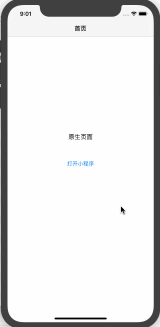

# react-native-uni

react-native 桥接uni小程序sdk


[uni小程序SDK](https://nativesupport.dcloud.net.cn/)
> uni-app 是一个使用 Vue.js 开发所有前端应用的框架，开发者编写一套代码，可发布到iOS、Android、H5、以及各种小程序（微信/支付宝/百度/头条/QQ/钉钉/淘宝）、快应用等多个平台。

有nvue部分底层使用weex实现的，但是感觉体验还是没有rn好。rn在国内又不太接地气，没有uni各种完善的第三方框架，就可以集成uni小程序sdk，使我们的react-native应用具有跟微信小程序类似的功能。



## Installation

###

```sh
npm install react-native-uni --save
//or
yarn add react-native-uni
```

## Usage

```js
import * as Uni from "react-native-uni";

// ...
Uni.initialize({...})
Uni.launch({appid: '__UNI__7586C24'})
```
rn >= 0.60 自动链接 `cd ios && pod install`
rn < 0.60

```bash
react-native link react-native-webview
```

安卓有些配置项请参考example项目

## 注意事项
[uni小程序官网](https://nativesupport.dcloud.net.cn/)
此项目是在react-native中集成uni的小程序sdk，相关注意事项参考官方文档
由于依赖weex等的相关包比较大，只是集成基础包应用都会大个20M左右。
此桥接库只默认集成了基础包，如果提示缺少模块，只需要去官网下载sdk添加缺少的包


## Api

### initialize(params?: Config): Promise<boolean>

```ts
type Config = {
  // 胶囊按钮的标题和标识
  items?: { title: string; key: string }[];
  //是否显示胶囊按钮
  capsule?: boolean;
  //安卓独有，胶囊按钮字体大小
  fontSize?: string;
  //安卓独有，胶囊按钮字体颜色
  fontColor?: string;
  //安卓独有，胶囊按钮字体宽度
  fontWeight?: string;
};
```
初始化框架，越前面越好，只需要调用一次


### setSplashView(component: ComponentType<{ appid: string }>)

设置小程序开启的启动页面

### launch(arg: LaunchArgs): Promise<boolean>

```ts
type LaunchArgs = {
  //uni小程序id
  appid: string;
  //需要传给小程序的参数
  params?: Object;
  //打开小程序的路径
  path?: string;
};
```

打开小程序。

### isExistsApp(appid: string): Promise<boolean>

根据小程序id判断是否存在小程序

### getRuningAppid(): Promise<string | null>

获取真正运行的小程序id

### getAppVersionInfo(appid: string): Promise<{ name: string; code: number } | null>

获取小程序版本信息

### getAppBasePath(appid: string): Promise<string>

获取小程序运行路径

### getCurrentPageUrl(): Promise<string>

获取当前小程序的直连url

### closeCurrentApp(): Promise<boolean>

关闭当前小程序

### releaseWgtToRunPathFromPath(path: string): Promise<boolean>

释放wgt文件

### onMenuClick(cb: (key: any) => void)

监听胶囊自定义按键启动

### onEventReceive(cb: (data: any) => void)

监听小程序向app发送的消息

### onAppClose(cb: () => void)

监听小程序关闭

## QA

#### 打release包出现以下错误
>  A failure occurred while executing com.android.build.gradle.internal.tasks.Workers$ActionFacade
   More than one file was found with OS independent path 'AndroidManifest.xml'

 `android/build.gradle` 修改gradle版本 `classpath("com.android.tools.build:gradle:3.4.0")`

## Contributing

See the [contributing guide](CONTRIBUTING.md) to learn how to contribute to the repository and the development workflow.


## License

MIT
